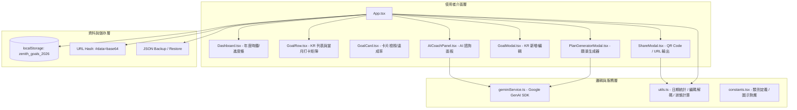

# Zenith 2026 年度策略規劃系統 (Annual Goal Tracker)

Zenith 是一套結合 **OKR 戰略框架**、**Gemini 3 Pro AI 智慧教練** 與 **全響應式日進度看板** 的年度目標管理系統。採用 Local-first 架構與無後端 URL Snapshot 分享協議。

---

## 系統架構總覽 (Architecture)



---

## 核心模組與目錄結構 (File Structure)

```
Zenith-Annual-Goal-Tracker/
├── index.html              # 入口 HTML、PWA Meta、字型與全域樣式
├── index.tsx               # React 19 Root Render
├── App.tsx                 # 主應用控制器：狀態管理、路由 Hash 監聽、同步控制
├── types.ts                # TypeScript 資料介面 (Goal, GoalCategory, DailyLog, YearStats)
├── constants.tsx           # 常數 (Storage Keys, Category Icons)
├── utils.ts                # 統計演算法、日期處理、URL-Safe Base64 壓縮/解壓縮
├── geminiService.ts        # Gemini 3 Pro 介接 (AI Coach 與 願景 KR 結構化生成)
├── vite.config.ts          # Vite 配置 (Port 3000, 環境變數注入, Alias)
├── manifest.json           # PWA 離線設定與桌面圖示
├── components/
│   ├── Dashboard.tsx       # 頂部儀表板：年底倒數、已過天數、年度進度條
│   ├── GoalRow.tsx         # 核心甘特打卡列：KR 指標、進度計算、31天點擊日誌
│   ├── GoalCard.tsx        # 獨立目標卡片檢視 (支援獨立數值微調與進度評估)
│   ├── GoalModal.tsx       # KR 目標建立與編輯彈窗
│   ├── AICoachPanel.tsx    # AI 教練戰略診斷面板 (分析落後指標並提供建議)
│   ├── PlanGeneratorModal.tsx # AI 願景拆解器 (輸入年度願景自動產生 SMART KR)
│   └── ShareModal.tsx      # 快照分享彈窗 (URL 壓縮、QR Code 生成、Web Share)
```

---

## 資料架構 (Data Models)

### `Goal` & `DailyLog` (目標與打卡紀錄)
```typescript
export enum GoalCategory {
  GROWTH = '成長輸入',
  HEALTH = '生活習慣',
  FINANCE = '財務管理',
  CAREER = '斜槓事業',
  SOCIAL = '社交生活',
  OTHER = '其他項目'
}

export interface DailyLog {
  date: string;  // YYYY-MM-DD (打卡日期)
  value: number; // 預設 1
}

export interface Goal {
  id: string;             // 唯一識別碼 (Base36 Random)
  title: string;          // 目標名稱 (如: 100 支短影音)
  category: GoalCategory; // 分類標籤
  krNumber: string;       // KR 編號 (如: KR1, KR2)
  target: number;         // 年度目標總量
  actual: number;         // 當前已累積完成數
  unit: string;           // 計算單位 (次、天、本、小時)
  description: string;    // 行動定義 / 完成標準
  logs: DailyLog[];       // 每日打卡記錄歷史
  createdAt: number;      // 建立時間戳記 (Epoch MS)
}
```

---

## 核心機制說明 (Key Mechanisms)

### 1. 效率評估演算法 (Efficiency Engine)
系統即時對比 **「目標達成率 (Actual / Target)」** 與 **「年度時間推進率 (Elapsed Days / 365)」**：
- $\Delta = \text{達成率} - \text{年度時間進度}$
- $\text{達成率} \ge 100\% \rightarrow$ **超標 🔥** (`red-600`)
- $\Delta \ge +5\% \rightarrow$ **領先 🚀** (`emerald-600`)
- $\Delta \le -5\% \rightarrow$ **落後 ⚠️** (`amber-600`)
- 其餘 $\rightarrow$ **正常 ✅** (`blue-600`)

### 2. 無伺服器快照分享 (Serverless Snapshot Sharing Protocol)
為了零伺服器成本傳遞完整的 KR 計畫，採用自訂 URL-Safe 壓縮協議：
1. **Minification**: 將 `Goal[]` 鍵名壓縮為 1~2 字元 (`i`, `t`, `c`, `k`, `tg`, `a`, `u`, `l`)，並濾除空描述以縮短長度。
2. **UTF-8 Encoding**: 使用 `TextEncoder` 轉為位元組陣列。
3. **URL-Safe Base64**: 將 `+` 轉為 `-`、`/` 轉為 `_`，並移除末尾補位 `=`。
4. **URL Hash 傳遞**: 格式為 `https://<domain>/#data=<compressed_base64>`。
5. **預覽與匯入機制**: 當偵測到 `#data=` 時進入唯讀預覽模式 (`isViewMode: true`)，使用者可一鍵「匯入為我的 2026 計畫」轉存入本地 `localStorage`。

### 3. Gemini 3 Pro 雙模態整合
- **AI 戰略教練 (`getAICoachFeedback`)**:
  - 提取所有目標的完成率與落後狀態，結合當前年份剩餘天數，由 Gemini 3 Pro 輸出 3 點高管級執行建議。
- **AI 願景生成器 (`generateGoalsFromVision`)**:
  - 採用 **Structured Outputs (Response Schema)**，強型別產出符合 `GoalCategory` 與 SMART 原則的 JSON KR 陣列。

---

## 本地開發與部署 (Getting Started)

### 需求環境
- Node.js 18+
- Gemini API Key

### 安裝與啟動
```bash
# 1. 安裝依賴套件
npm install

# 2. 設定環境變數 (.env.local)
echo "GEMINI_API_KEY=your_gemini_api_key_here" > .env.local

# 3. 啟動開發伺服器 (預設 Port 3000)
npm run dev

# 4. 構建生產版本
npm run build
```

